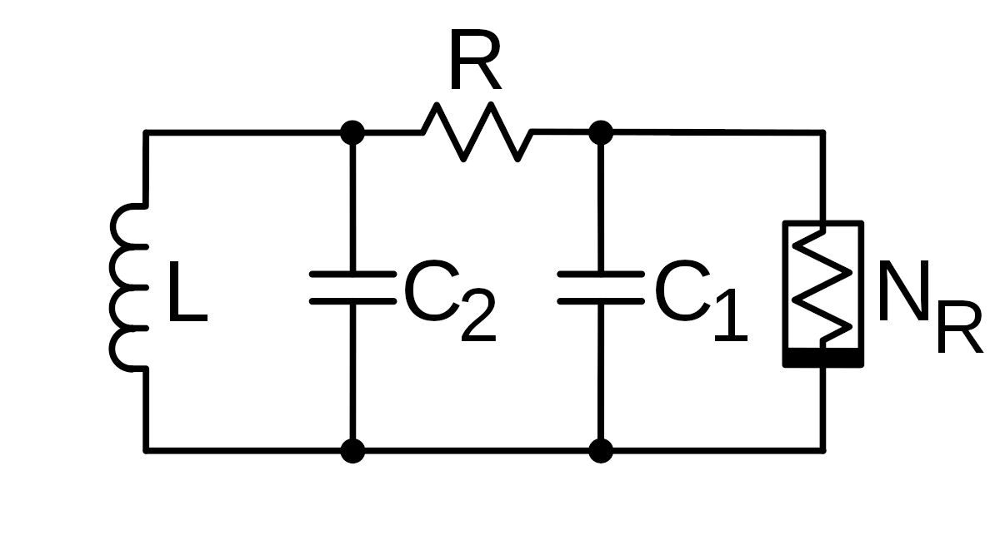
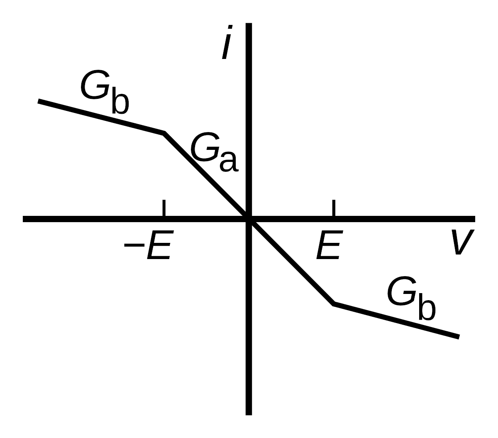
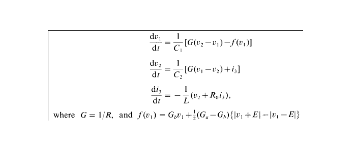
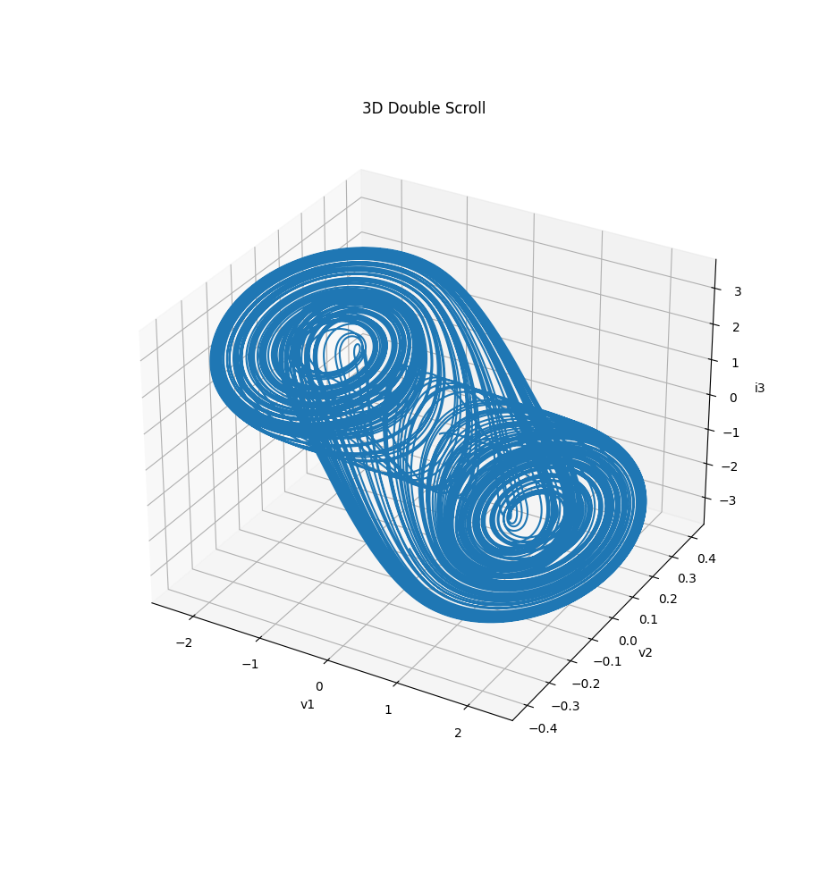
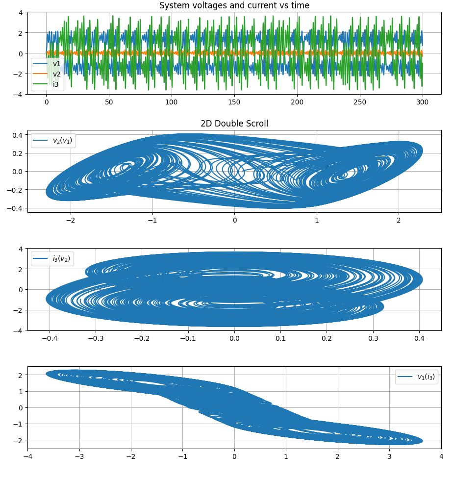

# Chua Oscillator
## Theory
A Chua Oscillator is a chaotic electronic oscillator, featuring one inductor, two capacitors, one resistor and a non-linear element called a _Chua diode_ referenced as _NR_ in the picture below. 

In this case, the diode's current-voltage characteristic is a three piecewise-linear function that can be built using operational amplifiers and resistors. In our case, it has been modeled by the following parameters:

Let f the function representing the diode's characteristic, `v1` and `v2` the tension of the right and the left capacitor and `i3` the current passing through the inductor. Using Kirchhoff's laws of electronics, we can derivate the following system.

##Simulation
With these equations, we can now simulate the evolution of the system with given starting conditions (and constant values for the resistance, inductance and capacity). These can be found in both `chua_osc.py` and `chua_osc_anim.py`, lines 12 to 26. 
We can solve the equation system with the `solve_ivp` method from the scipy package. Plotting the values in a (v1, v2, i3) coordinate system gives the following 3 dimensional scroll.

To get a deeper understanding of what is happening, we can plot a projection of this scroll and the evolution of v1, v2 and i3 in time.

We see that, while v2 oscillates around 0, v1 and i3 oscillate around two values: 1.8 and -1.8, and jump from one to the other in phase opposition. These are the 2 attractor values, causing the double scroll to appear in the phase space: each scroll is centered on one of these attraction points.
In a given circuit, the easiest constant value we can change is the resistance, using a potentiometer for example. The gif below shows the influence of the resistance on the output of this circuit.

It looks like the higher the value of the resistance, the more predictible the system gets: the double scroll is more well-defined. In the equations above, we can see that as R increases, G decreases. 
So, assuming R >> 1, that means G << 1. The only equation with more than one variable ramining is the second one and it is linear. The 2 other equations become single variable, almost linear ODE (the first one remains non-linear because of the Chua diode). This can explain why the system gets "less" chaotic as R increases.
